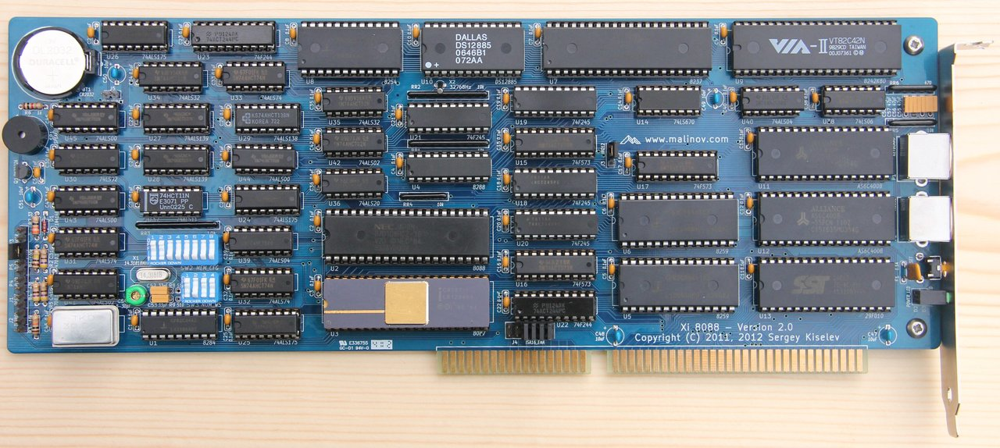

# Xi 8088
IBM XT Compatible Processor Board based on Intel 8xxx series ICs

## Introduction

Xi 8088 is an IBM PC/XT compatible processor board in ISA board form factor. It offers several enhancements over the standard IBM PC/XT, such as support of PS/2 keyboard and mouse and built-in real time clock with NVRAM (also known as CMOS setup memory).

## Specifications

* Processor: Intel 8088 or compatible, NEC V20.
  * Supports both standard 4.77MHz CPU clock and turbo, up to 13.33MHz, CPU clock operation.
* Coprocessor: Intel 8087.
* RAM: Up to 832 KiB of usable system memory (640 KiB base memory, and up to 192 KiB UMB); Implemented using SRAM.
* ROM: 128 KiB flash ROM. Configurable to either 64 KiB or 128 KiB.
* 8-bit ISA interface with several ISA/AT signals
* PS/2 compatible keyboard and mouse controller
* One 8237 direct memory access controller (DMAC)
* Two 8259 programmable interrupt controllers (PICs), supporting the total of 15 interrupts;  10 interrupts available for extension cards
* One 8254 programmable interval timer (PIT)
* One DS12885/DS12887 real time clock and non-volatile RAM (RTC/NVRAM) 
 
## Firmware / BIOS

[8088 BIOS](https://github.com/skiselev/8088_bios) - IBM PC/XT Compatible BIOS for Xi 8088

[xiflash](https://github.com/skiselev/xiflash) - Flash ROM Utility for Xi 8088

## Hardware Documentation

### Schematic and PCB Layout

[Schematic - Version 2.0](KiCad/8088-SBC-Schematic-Color-2.0.pdf)

[PCB Layout - Version 2.0](KiCad/8088-SBC-Board-Color-2.0.pdf)

### Memory Map

Start Address | End Address | Size    | Purpose        | Comments 
------------- | ----------- | ------- | -------------- | --------
0000h         | 9FFFFh      | 640 KiB | Base memory    |
0A0000h       | 0BFFFFh     | 128 KiB | Display memory | Actual addresses and size might vary depending on the type of the video adapter
0C0000h       | 0EFFFFh     | 192 KiB | Upper memory blocks (UMB) and BIOS extension ROMs | Consists of six 32 KiB user configurable blocks, can be either mapped to SRAM (to be used as UMB) or used for BIOS extension ROMs
0E0000h       | 0EFFFFh     | 64 KiB  | On-board BIOS extension ROM | System flash ROM can be mapped here, so it can be used for BIOS extensions
0F0000h       | 0FFFFFh     | 64 KiB  | System BIOS    | Currently BIOS uses only top 32 KiB of this space (0F8000h - 0FFFFFh). The other 32 KiB part is mapped to the flash ROM and can be used for BIOS extensions

### I/O Ports Map

Port Address | Device and/or Function          | Write                   | Read
------------ | ------------------------------- | ----------------------- | ----
00h          | DMAC - Channel 0                | Base/current address    | Current address
01h          | DMAC - Channel 0                | Base/current word count | Current word count
02h          | DMAC - Channel 1                | Base/current address    | Current address
03h          | DMAC - Channel 1                | Base/current word count | Current word count
04h          | DMAC - Channel 2                | Base/current address    | Current address
05h          | DMAC - Channel 2                | Base/current word count | Current word count
06h          | DMAC - Channel 3                | Base/current address    | Current address
07h          | DMAC - Channel 3                | Base/current word count | Current word count
08h          | DMAC - Command/Status Register  | Write command register  | Read status register
09h          | DMAC - Request Register         | Write request register  | N/A
0Ah          | DMAC - Single mask register bit | Write single mask register bit | N/A
0Bh          | DMAC - Mode register            | Write mode register     | N/A
0Ch          | DMAC - Clear byte pointer flip-flop | Clear byte pointer flip-flop | N/A
0Dh          | DMAC - Master clear/Read temporary register | Master clear | Read temporary register
0Eh          | DMAC - Clear mask register      | Clear mask register     | N/A
0Fh          | DMAC - Write all mask register bits | Write all mask register bits | N/A
10h-1Fh      | Alias for 00h-0Fh (DMAC)        |                         |
20h          | Master PIC                      |                         |
21h          | Master PIC                      |                         |
22h-3Fh      | Aliases for 20h-21h (Master PIC) |                        |
40h          | PIT - Channel 0                 |                         |  
41h          | PIT - Channel 1                 |                         |
42h          | PIT - Channel 2                 |                         |	 	 
43h          | PIT - Control Word              |                         |
44h-5Fh      | Aliases for 40h-43h (PIT)       |                         |
60h          | Keyboard controller             |                         |
61h          | Port B - Bit 0                  | 0 = Disable PIT Channel 2; 1 = Enable PIT Channel 2 (Note: Channel 2 is connected to the speaker) | 0 = PIT Channel 2 disabled; 1 = PIT Channel 2 enabled
61h          | Port B - Bit 1                  | 0 = Disable speaker; 1 = Enable speaker | 0 = Speaker disabled; 1 = Speaker enabled
61h          | Port B - Bit 2                  | 0 = Disable turbo mode; 1 = Enable turbo mode | 0 = Turbo mode disabled; 1 = Turbo mode enabled
61h          | Port B - Bit 3                  | 0 = Disable I/O check NMI; 1 = Enable I/O check NMI (Note: Write 0 followed by 1 to clear the I/O check NMI state condition) | 0 = I/O check NMI disabled; 1 = I/O check NMI disabled
61h          | Port B - Bit 4                  | N/A                     | PIT Channel 0 output divided by 2 (Toggles every 15 µs)
61h          | Port B - Bit 5                  | N/A                     | PIT Channel 2 output
61h          | Port B - Bit 6                  | N/A                     | 0 = No NMI from I/O check; 1 = NMI from I/O check
61h          | Port B - Bit 7                  | N/A                     | Always reads as 0
62h-63h      | Aliases for 60h-61h             |                         |
64h          | Keyboard controller             |                         |
65h-6Fh      | Aliases for 60h-04h             |                         |
70h          | RTC/NVRAM address, NMI control  |                         |
71h          | RTC/NVRAM data                  |                         |
72h-7Fh      | Aliases for 70h-71h (RTC)       |                         |
80h          | POST register                   |                         |
81h          | DMA Page Register - Channel 2   |                         |
82h          | DMA Page Register - Channel 3   |                         |
83h          | DMA Page Register - Channel 1   |                         |
84h-9Fh      | Aliases to 80h-83h              |                         |
0A0h         | Slave PIC                       |                         |
0A1h         | Slave PIC                       |                         |
0A2h-0BFh    | Aliases to 0A0h-0A1h            |                         |
0C0h-0FFh    | Unused, reserved                |                         |
0100h-03FFh  | Available for extension cards   |                         |

### Hardware Interrupts

Interrupt Number (IRQ#) | Default Software Interrupt Number | Device               | Comment
----------------------- | --------------------------------- | -------------------- | -------
0                       | 08h                               | PIT - Channel 0      | Default Frequency is 18.2 Hz 
1                       | 09h                               | KBC - Keyboard       |
2                       | 0Ah                               | Cascade to Slave PIC |
3                       | 0Bh                               | Available            |
4                       | 0Ch                               | Available            |
5                       | 0Dh                               | Available            |
6                       | 0Eh                               | Available            |
7                       | 0Fh                               | Available            |
8                       | 70h                               | RTC                  |
9                       | 71h                               | Available            | BIOS redirects IRQ9 to IRQ2 vector
10                      | 72h                               | Available            |
11                      | 73h                               | Available            |
12                      | 74h                               | KBC - PS/2 Mouse, or Available | Can be configured using jumper J3
13                      | 75h                               | Math coprocessor exception | BIOS redirects IRQ13 to NMI vector
14                      | 76h                               | Available            |
15                      | 77h                               | Available            |

### Jumpers, Connectors, and Switches

#### P1 - PS/2 Keyboard

Pin | Description
--- | -----------
1   | Keyboard data
2   | Unused
3   | GND
4   | +5V
5   | Keyboard clock
6   | Unused

#### P2 - PS/2 Mouse
 
Pin | Description
--- | -----------
1   | Mouse data
2   | Unused
3   | GND
4   | +5V
5   | Mouse clock
6   | Unused
 
#### P3 - Speaker

Pin | Description
--- | -----------
1   | Speaker output 
2   | Internal Speaker input
3   | Ground 
4   | +5V 

* Note: To enable internal speaker connect a jumper across pins 1-2

#### P4 - Power LED

Pin | Description
--- | -----------
1   | LED's anode (+)
2   | LED's cathode (-) 

#### P5 - Turbo LED

Pin | Description
--- | -----------
1   | LED's anode (+)
2   | LED's cathode (-) 

#### J1 - Reset Switch

Pin | Description
--- | -----------
1   | Ground
2   | Reset input

#### J2 - Turbo Switch

Position          | Description
----------------- | -----------
none              | Turbo off 
1-2               | Turbo on 
**2-3 (default)** | Turbo is software controlled (Port 61h bit 2)

#### J3 - IRQ12

Position          | Description
----------------- | -----------
**1-2 (default)** | IRQ12 is PS/2 mouse interrupt - connected to the keyboard controller
2-3               | IRQ12 is connected to the ISA bus

#### J4 - Enable ISA16 signals

Position | Description
-------- | -----------
1-2      | /MEMW is connected to ISA C10 (/MEMW)
3-4      | /MEMR is connected to ISA C9  (/MEMR)
5-6      | LA17 is connected to ISA  C8 (LA17)
7-8      | LA18 is connected to ISA  C7 (LA18)
9-10     | LA19 is connected to ISA  C6 (LA19)
11-12    | ISA C2 - C5 (LA20 - LA23) are connected to ground

Note: Set all jumpers for Cirrus Logic GD542x VGA cards, remove for all other cards.

#### J5 - Clear NVRAM

Position           | Description
------------------ | -----------
**none (default)** | Normal operation 
1-2                | Clear NVRAM (CMOS setup memory)

#### SW1 - Reset Switch

Press SW1 to reset the system

#### SW2 - Memory Configurations Switch

Position | Description
-------- | -----------
1        | ON = Map 0C0000h-0C7FFFFh to RAM
2        | ON = Map 0C8000h-0CFFFFFh to RAM
3        | ON = Map 0D0000h-0D7FFFFh to RAM
4        | ON = Map 0D8000h-0DFFFFFh to RAM
5        | ON = Map 0E0000h-0E7FFFFh to RAM
6        | ON = Map 0E0000h-0EFFFFFh to RAM
7        | ON =  64 KiB ROM starting from 0F0000h; OFF = 128 KiB ROM starting from 0E0000h
8        | ON = Monochrome display (MDA); OFF = Color display (CGA)

Notes:
* SW2.7 must be ON if SW2.5 or SW2.6 are ON
* VGA BIOS is usually mapped to 0C0000h-0C7FFFFh, when using VGA SW2.1 must be OFF

#### SW3 - I/O Wait States Configuration Switch

Position        | Description 
--------------- | -----------
**1 (default)** | ON = 1 I/O wait state
2               | ON = 2 I/O wait states
3               | ON = 3 I/O wait states
4               | ON = 4 I/O wait states

Note: One and only one of SW3 switches must be on

### Bill of Materials (BOM)

#### BOM Notes

#### BOM

Component type | Reference | Description                              | Quantity | Possible sources and notes 
-------------- | --------- | ---------------------------------------- | -------- | --------------------------
PCB            |           | Xi 8088 PCB Version 2.0                  | 1        | Todd Goodman or your favorite PCB manufacturer
Battery Holder | BT1       | CR2032 batter holder, 20 mm lead spacing | 1        | Jameco 355434; Mouser 122-2620-GR, 122-2520-GR, 122-2420-GR
Capacitor      | C1 - C46  | 0.1 uF ceramic, 5.08 mm lead spacing     | 46       | Mouser 810-FK28X7R1H104K, 80-C323C104K5R; Jameco 25523
Capacitor      | C47 - C51 | 10 uF ceramic, 5.08 mm lead spacing      | 5        | Mouser 810-FK24X5R1C106K. Note: Can be replaced with tantalum or electrolytic capacitors
Capacitor      | C52, C53  | 33 pF ceramic, 5.08 mm lead spacing      | 2        | Mouser 80-CK05BX330K-TR; Jameco 1947010. Note: Install only if using CMOS type of U1 82C84, for NMOS 8284 install R8 and R9 instead
Capacitor      | C54       | 5-30 pF trimmer capacitor                | 1        | Mouser 81-TZ03R300F169B00; Jameco 136979
Capacitor      | C55 - C58 | 47 pF ceramic, 5.08 mm lead spacing      | 4        | Mouser 80-CK05BX470K-TR; Jameco 1947036
Capacitor      | C59       | 0.01 uF ceramic, 5.08 mm lead spacing    | 1        | Mouser 80-C322C103K1R5CA; Jameco 597281
Diode          | D1        | 1N4148                                   | 1        | Jameco 36038, 179215; Mouser 512-1N4148, 771-1N4148-T/R
Diode          | D2, D3    | Bi-level LED indicator                   | 1        | Mouser 696-SSF-LXH240GYD; Jameco: Search for "Bi-Level LED", choose one with pins in square pattern (not in line)
Fuse           | F1        | 1.1A polyfuse, 5.04 mm lead spacing      | 1        | Mouser 576-16R110BPR; Jameco 199912
Connector      | J1, J2, P3, P4, P5 | 13x1 pin header                 | 1        | Mouser 649-68000-113HLF
Connector      | J3        | 3x1 pin header                           | 1        | Jameco 109576; Mouser 649-69190-103HLF, 649-78229-103HLF
Connector      | J4        | 6x2 pin header                           | 1        | Mouser 649-68021-212HLF
Connector      | J5        | 2x1 pin header                           | 1        | Jameco 108338; Mouser 649-78229-102HLF
Connector      | P1        | 6 pin Mini-DIN connector (Purple)        | 1        | Mouser 806-KMDGX-6S-BS2715C (Purple); Jameco 119475 (Black)
Connector      | P2        | 6 pin Mini-DIN connector (Green)         | 1        | Mouser 806-KMDGX-6S-BS3395C (Green); Jameco 119475 (Black)
Transistor     | Q1        | PN2222A                                  | 1        | Mouser 512-PN2222ATA
Resistor       | R1        | 100 kOhm, 1/4 W                          | 1        | Mouser 291-100K-RC
Resistor       | R2, R4, R5 | 470 Ohm, 1/4 W                          | 3        | Jameco 690785; Mouser 291-470-RC
Resistor       | R3        | 10 kOhm, 1/4 W                           | 1        | Jameco 691104; Mouser 291-10K-RC
Resistor       | R6        | 1 kOhm, 1/4 W                            | 1        | Mouser 291-1K-RC
Resistor       | R7        | 33 Ohm, 1/4 W                            | 1        | Mouser 291-33-RC
Resistor       | R8, R9    | 510 Ohm, 1/4 W                           | 2        | Mouser 291-510-RC. Note: Install only if using NMOS type of U1 8284, for CMOS 82C84 install C52 and C53 instead
Resistor Array | RR1 - RR3 | 10 kOhm, 10 pin, bussed resistor array   | 3        | Mouser 266-10K-RC
Resistor Array | RR4, RR5  | 10 kOhm, 6 pin, bussed resistor array    | 2        | Mouser 264-10K-RC
Resistor Array | RR6       | 470 Ohm, 6 pin, bussed resistor array    | 1        | Mouser 264-470-RC
Speaker        | SP1       | 12 mm speaker                            | 1        | Mouser 665-AT-1224TWTR
Switch         | SW1       | 6 mm tactile switch, right angle         | 1        | Mouser 653-B3F-3152
Switch         | SW2       | 8 positions DIP switch                   | 1        | Mouser 571-54356405
Switch         | SW3       | 4 positions DIP switch                   | 1        | Mouser 506-54356402
IC             | U1        | 8284 or 82C84 clock generator            | 1        | Avnet Express Intersil CP82C84AZ; Unicron Electronics (82C84)
IC             | U2        | 8088, 80C88, NEC V20, or NEC V20HL CPU   | 1        | Jameco 34358 (NEC V20, 8 Mhz), 52169 (8088, 8 MHz), 52142 (8088, 5 MHz); Unicorn Electronics; Avnet Express  Intersil IP80C88; Utsource; eBay
IC             | U3        | 8087 FPU                                 | 1        | 8087 FPU is an optional part. Unicorn Electronics; Utsource; eBay
IC             | U4        | 8288 or 82C88 bus controller             | 1        | Avnet Express Intersil CP82C88Z; Unicorn Electronics 82C88. Note: AMD 8288 part is not recommended
IC             | U5, U6    | 8259 or 82C59 PIC                        | 2        | Avnet Express Intersil CP82C59A-12Z; Jameco 52775; Unicorn Electronics 82C59 or 8259
IC             | U7        | 8237 or 82C37 DMAC                       | 1        | Unicorn Electronics 82C37 or 8237; eBay
IC             | U8        | 8254 or 82C54 PIT                        | 1        | Mouser 968-CP82C54-10Z; Avnet Express  CP82C54; Jameco 52716, 52708; Unicorn Electronics 82C54 or 8254
IC             | U9        | 8242, 82C42, VT82C42N, HT6542B           | 1        | Note: Original 8242 and 82C42 chips (usually made by Intel, Mitsubishi, or NEC) are generic mircocontrollers. Make sure to get one with PS/2 keyboard controller firmware, or use a dedicated keyboard controller, such as VIA VT82C42N (recommended).
IC             | U10       | DS12885 or DS12887                       | 1        | Mouser 700-DS12885N; Mouser 700-DS12887A; Avnet Express DS12885N+; Avnet Express DS12887A+; Jameco 1194513, 1194492 (DS12885); Jameco  133452 (DS12887). Note: DS12887 has a built-in battery and 32768 Hz crystal, no need to install BT1 and X2
IC             | U11, U12  | 512 KiB SRAM, 32 pin DIP - AS6C4008-55PCN | 2       | Mouser 913-AS6C4008-55PCN; Jameco 1927617
IC             | U13       | 128 KiB flash, 32 pin DIP - 39SF010, 29F010, 29C010 | 1 | Mouser 804-39SF010A7CPHE, 804-GLS29EE010-70PHE; Jameco 242608, 242595, 242587
IC             | U14       | 74LS670 or 74HCT670                      | 1        | Mouser 595-SN74LS670N, 771-HCT670N652; Unicorn Electronics 74LS670
IC             | U15 - U17 | 74F573 or 74ACT573                       | 3        | Mouser 595-SN74F573NE4, 595-SN74F573N, 595-SN74ACT573N, 595-CD74ACT573E; Jameco 282642; Unicorn Electronics 74F573
IC             | U18 - U21 | 74F245 or 74ACT245                       | 4        | Mouser 595-SN74F245N, 771-NF245N602, 595-SN74ACT245N, 595-CD74ACT245E; Jameco 287144; Unicorn Electronics 74F245
IC             | U22, U23  | 74F244 or 74ACT244                       | 2        | Mouser 595-SN74F244N, 771-NF244N602, 595-SN74ACT244N, 595-CD74ACT244E, 863-MC74ACT244NG; Jameco 212054; Unicorn Electronics 74F244
IC             | U24 - U26 | 74ALS175, 74AHCT175, or 74ACT175         | 3        | Mouser 595-SN74ALS175NE4, 595-SN74ALS175N, 595-CD74ACT175E; Unicorn Electronics 74ALS175, 74AHCT175
IC             | U27, U28  | 74ALS139 or 74AHCT139                    | 2        | Mouser 595-SN74ALS139N, 595-SN74AHCT139N; Jameco 46623, 301268, 63773, 239011; Unicorn Electronics 74ALS139
IC             | U29       | 74ALS138 or 74AHCT138                    | 1        | Mouser 595-SN74ALS138AN, 512-DM74ALS138N, 595-SN74AHCT138N; Jameco 46607, 46608, 301233, 44927; Unicorn Electronics 74ALS138, 74AHCT138
IC             | U30       | 74LS92                                   | 1        | Mouser 595-SN74LS92NE4; Jameco 48143; Unicorn Electronics 74LS92
IC             | U31 - U33 | 74ALS74 or 74AHCT74                      | 3        | Mouser 595-SN74ALS74AN, 512-DM74ALS74AN, 595-SN74AHCT74N; Unicorn Electronics 74ALS74, 74AHCT74
IC             | U34, U35  | 74ALS32 or 74AHCT32                      | 2        | Mouser 595-SN74ALS32N, 512-DM74ALS32N, 595-SN74AHCT32N; Jameco 44134, 47466, 47467, 295515; Unicorn Electronics 74ALS32, 74AHCT32
IC             | U36       | 74ALS20 or 74ACT20                       | 1        | Mouser 595-SN74ALS20ANE4, 595-SN74ALS20AN, 595-CD74ACT20EE4, 595-CD74ACT20E; Unicorn Electronics 74ALS20
IC             | U37       | 74ALS11, 74AHCT11, or 74ACT11            | 1        | Mouser 595-SN74ALS11AN, 595-SN74ACT11N; Unicorn Electronics 74ALS11
IC             | U38       | 74LS06                                   | 1        | Mouser 595-SN74LS06N; Jameco 46359; Unicorn Electronics 74LS06
IC             | U39       | 74F04, 74ACT04                           | 1        | Mouser 595-SN74F04N, 595-SN74ACT04N. Note: This IC should have higher output current (about 20 mA), 74LS04, 74ALS04, or 74AHCT04 can be used, but it might result in stability issues especially on higher CPU frequency.
IC             | U40       | 74ALS04, 74AHCT04                        | 1        | Mouser 595-SN74ALS04BNE4, 595-SN74ALS04BN, 595-SN74AHCT04NE4; Jameco  970621; Unicorn Electronics 74ALS04, 74AHCT04
IC             | U41, U42  | 74ALS02, 74AHCT02                        | 2        | Mouser 595-SN74ALS02ANE4, 595-SN74ALS02AN, 595-SN74AHCT02N; Unicorn Electronics 74ALS02, 74AHCT02
IC             | U43 - U45 | 74ALS00, 74AHCT00                        | 3        | Mouser 595-SN74ALS00AN, 595-SN74AHCT00NE4, 595-SN74AHCT00N; Jameco 245294; Unicorn Electronics 74ALS00, 74AHCT00
Crystal Oscillator  | U46  | Turbo clock oscillator - 24 MHz          | 1        | Note: U46 frequency should be desired CPU turbo frequency multiplied by 3 (24 MHz for 8 MHz CPU, 30 MHz for 10 MHz CPU, etc.). Mouser 774-MXO45-3C-24.0 (24 MHz); Jameco 2135321 (24 MHz), 325438 (30 MHz)
IC Socket      | U2, U3, U7, U9 | 40 pin 600 mil DIP socket           | 4        | Mouser 517-4840-6000-CP, 649-DILB40P223TLF; Jameco 41111
IC Socket      | U11 - U13 | 32 pin 600 mil DIP socket                | 3        | Mouser 517-4832-6000-CP, 649-DILB32P223TL; Jameco 112301
IC Socket      | U5, U6    | 28 pin 600 mil DIP socket                | 2        | Mouser 517-4828-6000-CP, 649-DILB28P223TLF
IC Socket      | U8, U10   | 24 pin 600 mil DIP socket                | 2        | Mouser 517-4824-6000-CP
IC Socket      | U4, U15 - U23 | 20 pin 300 mil DIP socket            | 10       | Mouser 517-4820-3000-CP, 649-DILB20P-223TLF; Jameco 112248
IC Socket      | U1        | 18 pin 300 mil DIP socket                | 1        | Mouser 517-4818-3000-CP
IC Socket      | U14, U24 - U29 | 16 pin 300 mil DIP socket           | 7        | Mouser 517-4816-3000-CP, 649-DILB16P-223TLF; Jameco  37373
IC Socket      | U30 - U45 | 14 pin 300 mil DIP socket                | 16       | Jameco 37162; Mouser 517-4814-3000-CP, 649-DILB14P-223TLF
Oscillator Socket | U46    | 4 pin 300 mil DIP full can oscillator socket | 1    | Mouser 535-1107741; Jameco  133006
Crystal        | X1        | 14.31818 MHz AT cut crystal              | 1        | Mouser 73-XT49S1431-20
Crystal        | X2        | 32768 Hz tune fork crystal               | 1        | Mouser 732-C002RX32.76K-EPB, 695-CFS206-327KB-U; Jameco 14584
ISA Mounting Bracket |     | Keystone 9205                            | 1        | Mouser 534-9205. Note: Drill holes for PS/2 connectors, LEDs, and the reset switch
Screw          | HOLE1, HOLE2 | Screw 4-40 diameter, 1/4" length      | 2        | Mouser 534-9900 

#### Replacement Notes

* Intel 8xxx ICs - Either CMOS  (8xCxx) or NMOS/TTL ICs can be used. CMOS and particularly NEC V20 CPU and Intersil 82Cxx peripheral ICs are preferred because of their lower power consumption and higher performance
* 74xx logic ICs - Advanced TTL-LS (74ALS, 74F) or advanced TTL compatible CMOS (74AHCT, 74ACT) are recommended, especially for turbo CPU clock frequencies. Some parts (74LS92, 74LS06, 74LS670) are not available in these series, so regular 74LS and 74HCT should be used. With that being said most of logic parts are not very speed sensitive, especially if running on standard 4.77 MHz clock, with exception of 74ALS74 in wait state generator, so generally 74LS series ICs can be used. 74F and 74ACT are preferred parts for bus driving circuits (74x244, 74x245, 74x573)
* For higher clock frequency (more than 8 MHz) along with 74ALS or 74AHCT for most logic, it is recommended to use faster U31, U32, U24 and U25. For example 74F or 74ACT series.
